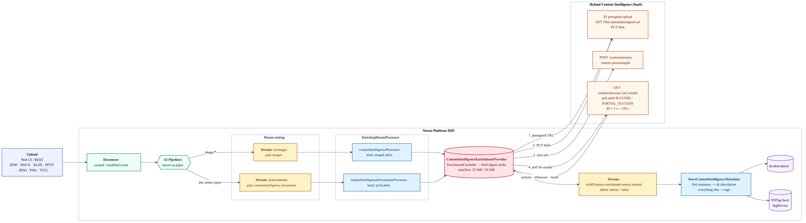

# Nuxeo AI Content Intelligence integration

An enrichment provider that calls the [Hyland Content Intelligence](https://hyland.com/) Knowledge Enrichment APIs from
the Content Innovation Cloud and maps the response onto Nuxeo document metadata (`dc:description` + tags). It is built
on top of the upstream `nuxeo-content-intelligence-connector-core` and integrates with the standard `nuxeo-ai-core`
pipeline.

Currently, provides the following enrichment services:

* `ai.contentintelligence` - Image pipeline. Calls Hyland CI for `image-description` and
  `named-entity-recognition-image`. Writes the description to `dc:description` and the entities as tags.
* `ai.contentintelligence.documents` - Document pipeline (PDF / Word / Excel / PowerPoint / plain text). Calls Hyland
  CI for `text-summarization` and `named-entity-recognition-text`. Writes the summary to
  `dc:description` and the entities as tags.
* `ai.contentintelligence.all` - Optional full-feature image provider (`image-description`,
  `image-embeddings`, `image-metadata-generation`). Disabled by default.

## Architecture

The diagram below shows the runtime path from an upload event through the Nuxeo AI pipelines, the
`ContentIntelligenceEnrichmentProvider` call against the Hyland Content Intelligence SaaS (presigned upload → POST
`/content/process` → poll `GET /content/process/{id}/results`), and the final persistence step in
`StoreContentIntelligenceMetadata` / `ContentIntelligenceDescriptionListener`.



#### Credentials

Credentials are consumed from the Content Innovation Cloud application configuration and set in `nuxeo.conf`:

```
nuxeo.hyland.cic.auth.baseUrl=https://YOUR_CIC_AUTH_BASE_URL
nuxeo.hyland.cic.contextEnrichment.baseUrl=https://YOUR_CIC_ENRICHMENT_BASE_URL
nuxeo.hyland.cic.enrichment.clientId=YOUR_CLIENT_ID
nuxeo.hyland.cic.enrichment.clientSecret=YOUR_CLIENT_SECRET
```

## Installation

#### Quick start

1. Install the nuxeo-ai-content-intelligence package. `./bin/nuxeoctl mp-install nuxeo-ai-content-intelligence`

2. Add the following parameters to `nuxeo.conf`.

```
nuxeo.ai.images.enabled=true
nuxeo.ai.contentintelligence.enabled=true
nuxeo.ai.contentintelligence.documents.enabled=true
nuxeo.enrichment.save.facets=true
nuxeo.enrichment.raiseEvent=true
nuxeo.hyland.cic.auth.baseUrl=https://YOUR_CIC_AUTH_BASE_URL
nuxeo.hyland.cic.contextEnrichment.baseUrl=https://YOUR_CIC_ENRICHMENT_BASE_URL
nuxeo.hyland.cic.enrichment.clientId=YOUR_CLIENT_ID
nuxeo.hyland.cic.enrichment.clientSecret=YOUR_CLIENT_SECRET
```

3. Start Nuxeo and upload an image or a document.
4. Wait a few seconds (text actions can take 60-120s) then look at the document's `dc:description` and `dc:tags`.

##### Coexistence with other providers

When you run this addon alongside AWS / GCP / Sightengine and set `nuxeo.enrichment.save.tags=true`, the upstream
`StoreLabelsAsTags` consumer handles tag persistence for every provider, including Hyland CI. In that case the addon's
own `StoreContentIntelligenceMetadata` consumer is automatically disabled (see
`ai-content-intelligence-config.xml.nxftl`) to avoid duplicate tags with slightly different sanitization. The long-form
description is always persisted to `dc:description` by `ContentIntelligenceDescriptionListener`, regardless of the
`nuxeo.enrichment.save.tags` value, because the description deliberately never travels through the labels stream.

### Configuration Parameters

You can set these in your `nuxeo.conf`.
<div class="table-scroll">
<table class="hover">
<tbody>
<tr>
<th width="250" colspan="1">Parameter</th>
<th colspan="1">Description</th>
<th width="250" colspan="1">Default value</th>
<th width="150" colspan="1">Since</th>
</tr>
<tr>
<td colspan="1"><code>nuxeo.hyland.cic.auth.baseUrl</code></td>
<td colspan="1">Base URL of the Hyland CIC authentication endpoint.</td>
<td colspan="1"></td>
<td colspan="1">Since 5.0.2</td>
</tr>
<tr>
<td colspan="1"><code>nuxeo.hyland.cic.contextEnrichment.baseUrl</code></td>
<td colspan="1">Base URL of the Hyland CIC Knowledge Enrichment endpoint.</td>
<td colspan="1"></td>
<td colspan="1">Since 5.0.2</td>
</tr>
<tr>
<td colspan="1"><code>nuxeo.hyland.cic.enrichment.clientId</code></td>
<td colspan="1">OAuth client id used to obtain a token against the CIC auth endpoint.</td>
<td colspan="1"></td>
<td colspan="1">Since 5.0.2</td>
</tr>
<tr>
<td colspan="1"><code>nuxeo.hyland.cic.enrichment.clientSecret</code></td>
<td colspan="1">OAuth client secret used to obtain a token against the CIC auth endpoint.</td>
<td colspan="1"></td>
<td colspan="1">Since 5.0.2</td>
</tr>
<tr>
<td colspan="1"><code>nuxeo.hyland.cic.pullResultsMaxTries</code></td>
<td colspan="1">Number of polling attempts against <code>GET /content/process/{id}/results</code>.</td>
<td colspan="1"><code>40</code></td>
<td colspan="1">Since 5.0.2</td>
</tr>
<tr>
<td colspan="1"><code>nuxeo.hyland.cic.pullResultsSleepInterval</code></td>
<td colspan="1">Sleep interval (ms) between two polling attempts.</td>
<td colspan="1"><code>3000</code></td>
<td colspan="1">Since 5.0.2</td>
</tr>
<tr>
<td colspan="1"><code>nuxeo.ai.enrichment.call.timeout.seconds</code></td>
<td colspan="1">Per-call Failsafe timeout (s) around a single enrichment provider invocation. Raised above the platform default for this addon because text actions routinely take more than 60 s.</td>
<td colspan="1"><code>180</code></td>
<td colspan="1">Since 5.0.2</td>
</tr>
<tr>
<td colspan="1"><code>nuxeo.ai.contentintelligence.enabled</code></td>
<td colspan="1">Master switch for the image pipeline (<code>ai.contentintelligence</code>).</td>
<td colspan="1"><code>true</code></td>
<td colspan="1">Since 5.0.2</td>
</tr>
<tr>
<td colspan="1"><code>nuxeo.ai.contentintelligence.actions</code></td>
<td colspan="1">Comma-separated Knowledge Enrichment actions requested by the image provider.</td>
<td colspan="1"><code>image-description,named-entity-recognition-image</code></td>
<td colspan="1">Since 5.0.2</td>
</tr>
<tr>
<td colspan="1"><code>nuxeo.ai.contentintelligence.maxSize</code></td>
<td colspan="1">Removed. The provider no longer enforces a client-side blob size cap: <code>ContentIntelligenceEnrichmentProvider#supportsSize()</code> always returns <code>true</code> so every eligible blob reaches the Hyland CI API, and CIC enforces its own ceiling. Remove this property from your <code>nuxeo.conf</code>.</td>
<td colspan="1">&mdash;</td>
<td colspan="1">Removed in 5.0.2</td>
</tr>
<tr>
<td colspan="1"><code>nuxeo.ai.contentintelligence.documents.enabled</code></td>
<td colspan="1">Master switch for the document pipeline (<code>ai.contentintelligence.documents</code>).</td>
<td colspan="1"><code>true</code></td>
<td colspan="1">Since 5.0.2</td>
</tr>
<tr>
<td colspan="1"><code>nuxeo.ai.contentintelligence.documents.actions</code></td>
<td colspan="1">Comma-separated Knowledge Enrichment actions requested by the document provider.</td>
<td colspan="1"><code>text-summarization,named-entity-recognition-text</code></td>
<td colspan="1">Since 5.0.2</td>
</tr>
<tr>
<td colspan="1"><code>nuxeo.ai.contentintelligence.documents.mimeTypes</code></td>
<td colspan="1">Comma-separated MIME types routed into the document CI pipeline. Single source of truth for both the pipe filter regex and the enrichment descriptor's <code>&lt;mimeTypes&gt;</code> entries.</td>
<td colspan="1">PDF / Word / Excel / PowerPoint / text/plain</td>
<td colspan="1">Since 5.0.2</td>
</tr>
<tr>
<td colspan="1"><code>nuxeo.ai.contentintelligence.documents.maxSize</code></td>
<td colspan="1">Removed. Same rationale as <code>nuxeo.ai.contentintelligence.maxSize</code> above &mdash; no client-side cap is enforced for the document provider either. Remove this property from your <code>nuxeo.conf</code>.</td>
<td colspan="1">&mdash;</td>
<td colspan="1">Removed in 5.0.2</td>
</tr>
<tr>
<td colspan="1"><code>nuxeo.ai.contentintelligence.all</code></td>
<td colspan="1">Enables the optional secondary <code>ai.contentintelligence.all</code> provider that also requests <code>image-embeddings</code> and <code>image-metadata-generation</code>.</td>
<td colspan="1"><code>false</code></td>
<td colspan="1">Since 5.0.2</td>
</tr>
<tr>
<td colspan="1"><code>nuxeo.ai.contentintelligence.description.maxLength</code></td>
<td colspan="1">Caps the description length written to <code>dc:description</code>. Empty, zero, or negative values disable the cap.</td>
<td colspan="1"></td>
<td colspan="1">Since 5.0.2</td>
</tr>
</tbody>
</table>
</div>

# License

[Apache License, Version 2.0](http://www.apache.org/licenses/LICENSE-2.0.html)

# About Nuxeo

Nuxeo dramatically improves how content-based applications are built, managed and deployed, making customers more agile,
innovative and successful. Nuxeo provides a next generation, enterprise ready platform for building traditional and
cutting-edge content oriented applications. Combining a powerful application development environment with SaaS-based
tools and a modular architecture, the Nuxeo Platform and Products provide clear business value to some of the most
recognizable brands including Verizon, Electronic Arts, Netflix, Sharp, FICO, the U.S. Navy, and Boeing. Nuxeo is
headquartered in New York and Paris. More information is available at www.nuxeo.com.
